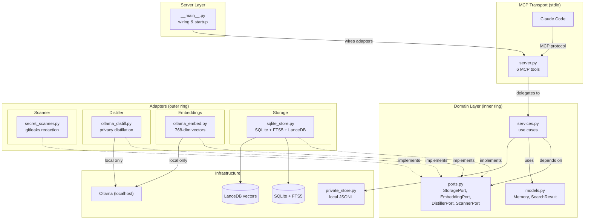

# Architecture

> Auto-generated from GitNexus knowledge graph (315 symbols, 765 relationships, 17 execution flows)

## Overview

Distill is a privacy-first MCP server that gives Claude Code access to a shared team knowledge base. Raw developer input is distilled into anonymous factual knowledge by a local LLM (Ollama) before anything leaves the device. The architecture follows Clean Architecture (Uncle Bob) — dependencies point inward, business logic has no knowledge of frameworks or infrastructure.

## Functional Areas

The codebase is organized into 5 functional clusters:

| Area | Symbols | Cohesion | Responsibility |
|------|---------|----------|----------------|
| **Distill_mcp** | 20 | 90% | MCP server entry point, tool definitions, adapter wiring |
| **Domain** | 25 | 76% | Core business logic: services, models, port interfaces |
| **Storage** | 7 | 88% | SQLite + FTS5 + LanceDB persistence, hybrid search, dedup |
| **Scanner** | 7 | 93% | Secret detection and redaction (gitleaks-based) |
| **Tests** | 94 | 79% | Unit and integration test suite |

## Architecture Diagram



## Key Execution Flows

### 1. Server Startup (`Main → _migrate`)

The bootstrap sequence wires adapters to ports and initializes storage.

```
main (__main__.py)
 → _run_server (__main__.py)
    → SqliteStore.initialize (sqlite_store.py)
       → _create_tables (sqlite_store.py)
          → _migrate (sqlite_store.py)
```

Also wires `OllamaEmbedder` and `OllamaDistiller` into the service layer via port injection.

### 2. Remember Flow (`Remember → _cleanup_private_file`)

Stores new knowledge after distillation and privacy checks.

```
remember (services.py)
 → distill raw text via DistillerPort (localhost Ollama)
 → scan for secrets via ScannerPort
 → check_duplicate via StoragePort (cosine > 0.95 rejects)
 → save to StoragePort
 → _prune_expired (services.py)
    → _cleanup_private_file (services.py)
```

With `REVIEW_BEFORE_SAVE=true` (default), the flow splits into a two-phase commit:
- `remember` → returns pending preview (stored in `_PendingEntry`)
- `confirm_memory` → finalizes the save after user approval

### 3. Search Flow (`Search_memory → Embed`)

Hybrid search combining full-text and vector similarity with Reciprocal Rank Fusion.

```
search_memory (server.py)
 → search (services.py)
    → embed query via EmbeddingPort (768-dim vector)
    → StoragePort.search:
       → _fts_search → _sanitize_fts (FTS5 full-text)
       → _vec_search → _has_vec_table (LanceDB vector)
       → rrf_merge (k=60 fusion)
    → record_access (spaced-repetition scoring)
```

Returns a compact index (~30 tokens/result) for progressive disclosure. Clients fetch full content with `get_memories` for relevant results only.

### 4. Dedup Check (`Check_duplicate → _sanitize_fts`)

Prevents storing near-duplicate memories.

```
check_duplicate (sqlite_store.py)
 → search (sqlite_store.py)
    → _fts_search → _sanitize_fts (sanitize query for FTS5)
    → _vec_search → _has_vec_table (check vector table exists)
    → rrf_merge → SearchResult (combined ranking)
```

If the top result has cosine similarity > 0.95, the insert is rejected and the existing memory ID is returned.

### 5. Confirm Flow (`Confirm_memory → _cleanup_private_file`)

Second phase of the two-phase commit for reviewed memories.

```
confirm_memory (services.py)
 → retrieve _PendingEntry
 → optionally re-embed if content was overridden
 → save to StoragePort
 → _prune_expired (services.py)
    → _cleanup_private_file (services.py)
```

## Data Flow & Privacy Boundary

```
Developer input (raw text)
        │
        ▼
   ┌─────────────┐
   │ private_store│ ← JSONL, never synced, local only
   └──────┬──────┘
          │
          ▼
   ┌─────────────┐
   │   Ollama     │ ← localhost, never crosses network
   │  (distill)   │
   └──────┬──────┘
          │ distilled fact (no names, no emotion, no PII)
          ▼
   ┌─────────────┐
   │   Scanner    │ ← redacts any leaked secrets
   └──────┬──────┘
          │
          ▼
   ┌─────────────┐
   │  SQLite +    │ ← team-safe knowledge
   │  LanceDB     │
   └─────────────┘
```

## Port Interfaces

All adapters implement these abstract interfaces (defined in `domain/ports.py`):

- **StoragePort** — `save`, `get`, `search`, `delete`, `check_duplicate`, `list_recent`, `record_access`
- **EmbeddingPort** — `embed(text) → list[float]` (768 dimensions)
- **DistillerPort** — `distill(raw_text) → str`
- **ScannerPort** — `scan(text) → list[Finding]`, `redact(text) → str`, `has_secrets(text) → bool`

## Backend Options

| Backend | Storage | Vectors | Embeddings | Distillation | Cost |
|---------|---------|---------|------------|--------------|------|
| `local` | SQLite + FTS5 | LanceDB | Ollama | Ollama | $0 |
| `gcp` | Cloud SQL PostgreSQL | pgvector | Vertex AI | Ollama (local) | ~$11/mo |

Distillation is **always local** regardless of backend — this is the privacy guarantee.
