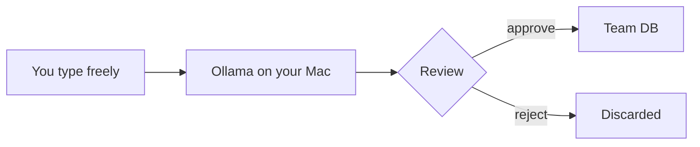

# Distill

[](https://github.com/5queezer/distill/actions/workflows/ci.yml)

[](LICENSE)

An MCP server that gives Claude Code a shared team knowledge base — a local LLM transforms your raw input into anonymous, factual knowledge *before* anything leaves your device.

```
You type:        "I spent 3 days trying Redis pub/sub and it's garbage.
                  Bob suggested Kafka but I ignored him."

Team DB gets:    "Redis pub/sub is unsuitable for the event-bus use case
                  due to message loss under load. Evaluate Kafka or NATS.
                  (Q1 2026)"
```

No author. No frustration. No names. Just a clean, reusable fact.




## Quick Start

```bash
pip install distill-mcp
ollama pull gemma3:4b && ollama pull nomic-embed-text
claude mcp add distill -- python -m distill_mcp
```

Try it:

```
You:    "Remember that we chose gRPC over REST for streaming and type safety."
Claude: [distills locally, shows preview, waits for approval, saves]
```

## How it works

The local LLM is not optional — it's the privacy component. Raw text goes to Ollama on localhost, gets distilled into an anonymous fact, and only the clean output enters the team database. Your raw text never crosses a network boundary.

## Self-learning

Distill ships with built-in instructions that make Claude Code use memory automatically — no prompting needed. It saves when you correct a mistake or make a decision, and searches before proposing architecture or answering "how should we..." questions.

```
You:    "No, we don't use REST here. We switched to gRPC last month."

Claude: [saves to distill]
        Got it. I've noted that the team uses gRPC, not REST.

        ... next session, different repo ...

You:    "Set up the API for this new service."

Claude: [searches distill → finds gRPC decision]
        Based on your team's knowledge, I'll set up a gRPC
        service since the team switched from REST last month.
```

## Usage

Once installed, Claude Code can use Distill naturally:

```
You:    "Remember that we chose gRPC over REST for inter-service
         communication because of streaming support and type safety."

Claude: I've distilled this into team knowledge:

        "gRPC was chosen over REST for inter-service communication
         due to streaming support and type safety. (2026-03)"

        Should I save this to the team knowledge base?

You:    "Yes"

Claude: Saved as memory abc-123.
```

```
You:    "How do our services communicate?"

Claude: [searches team memory]
        Based on your team's knowledge base, inter-service communication
        uses gRPC, chosen for streaming support and type safety.
```

## Tools

| Tool | What it does |
|------|-------------|
| `remember` | Distill raw input into an anonymous fact (returns preview for approval) |
| `confirm_memory` | Confirm a pending preview and store it |
| `search_memory` | Hybrid search — returns compact index (~30 tokens/result) |
| `get_memories` | Fetch full content for specific IDs (batch) |
| `get_memory` | Retrieve a single memory by ID |
| `update_memory` | Re-distill and supersede an existing memory |
| `list_recent` | Browse recent memories, filter by repo/tag/type |
| `forget` | Soft-delete |

## Privacy

| Question | Answer |
|----------|--------|
| Does Anthropic see my raw input? | No. It goes to local Ollama only. |
| Can my team read what I typed? | No. Only the distilled fact is stored. |
| Can my manager see who wrote what? | Only if you opt in. Anonymous by default. |
| Where is my raw text? | `~/.distill/private/` on your Mac. Delete anytime. |
| What if distillation leaks a name? | You review every output before it's saved. |

## Configuration

```bash
# These are the defaults — override as needed
export BACKEND=local                    # local or gcp
export DISTILL_MODEL=gemma3:4b          # Ollama model for distillation
export EMBEDDING_MODEL=nomic-embed-text # Ollama model for embeddings
export AUTHOR_MODE=anonymous            # anonymous | pseudonym | named
export REVIEW_BEFORE_SAVE=true          # show distilled output for approval
export DATA_DIR=~/.distill              # local data directory
```

## Backends

**Local** (default) — SQLite + LanceDB + Ollama. Everything on your Mac. $0/month.

**GCP** — Cloud SQL + pgvector + Vertex AI embeddings. Distillation still runs locally on your Mac. Team members share the same database. ~$11/month.

```bash
# Switch to GCP backend
export BACKEND=gcp
export DB_HOST=127.0.0.1      # via Cloud SQL Proxy
export DB_NAME=distill
export GCP_PROJECT=your-project
```

## What makes this different

Every "memory MCP" stores your raw text in a database. Distill doesn't. The local LLM is a mandatory privacy gateway that transforms personal thoughts into impersonal team knowledge. This is the only product where contributing knowledge is psychologically safe because your exact words never leave your machine.

|  | Raw stays local | LLM distills | Team sync | Platform agnostic |
|--|----------------|-------------|-----------|-------------------|
| Claude-Mem | Partial (`<private>` opt-out) | Cloud API compresses | Single-user | Claude Code only |
| Cipher | No | No | Yes | No |
| Supermemory | No | No | Yes | No |
| Mem0 | Yes | No | No | Yes |
| Memctl | Yes | No | Yes | Yes |
| **Distill** | **Yes** | **Yes** | **Yes** | **Yes** |

Based on public documentation as of March 2026.

## Architecture

```
src/distill_mcp/
├── domain/           # Business logic (no external dependencies)
│   ├── models.py     # Memory, SearchResult
│   ├── ports.py      # StoragePort, EmbeddingPort, DistillerPort
│   └── services.py   # remember, search, update, forget
├── adapters/         # Implementations
│   ├── storage/      # SQLite or PostgreSQL
│   ├── embeddings/   # Ollama or Vertex AI
│   └── distiller/    # Ollama (always local)
├── server.py         # MCP tool definitions
└── __main__.py       # Entry point
```

Clean Architecture. Dependencies point inward. `domain/` has zero knowledge of FastMCP, SQLite, or Ollama.

## Development

```bash
git clone https://github.com/5queezer/distill.git
cd distill
uv sync
uv run pytest tests/ -x -v
uv run ruff check .

# Test with MCP Inspector
fastmcp dev src/distill_mcp/server.py

# Install in Claude Code
fastmcp install claude-code src/distill_mcp/server.py
```

## License

[MIT](LICENSE)
