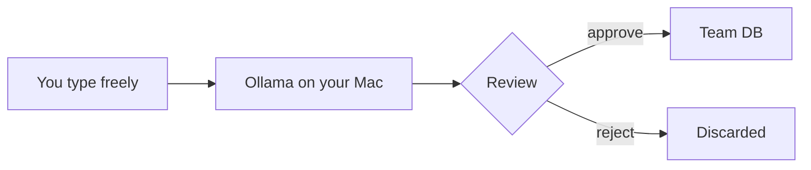

# Distill

[](https://github.com/5queezer/distill/actions/workflows/ci.yml)

[](LICENSE)

An MCP server that gives Claude Code a shared team knowledge base — a local LLM transforms your raw input into anonymous, factual knowledge *before* anything leaves your device.

No author. No frustration. No names. Just a clean, reusable fact.




## Quick Start

```bash
pip install distill-mcp
ollama pull gemma3:4b && ollama pull nomic-embed-text
claude mcp add distill -- python -m distill_mcp
```

Then in Claude Code:

```
You:    "No, we don't use REST here. We switched to gRPC last month."

Claude: [saves to distill]
        Got it. I've noted that the team uses gRPC, not REST.

        ... next session, different repo ...

You:    "Set up the API for this new service."

Claude: [searches distill → finds gRPC decision]
        Based on your team's knowledge, I'll set up a gRPC
        service since the team switched from REST last month.
```

Distill saves when you correct a mistake or make a decision, and searches before proposing architecture — no prompting needed.

## What makes this different

Every "memory MCP" stores your raw text in a database. Distill doesn't. The local LLM is a mandatory privacy gateway that transforms personal thoughts into impersonal team knowledge.

|  | Raw stays local | LLM distills | Team sync | Platform agnostic |
|--|----------------|-------------|-----------|-------------------|
| Claude-Mem | Partial (`<private>` opt-out) | Cloud API compresses | Single-user | Claude Code only |
| Cipher | No | No | Yes | No |
| Supermemory | No | No | Yes | No |
| Mem0 | Yes | No | No | Yes |
| Memctl | Yes | No | Yes | Yes |
| **Distill** | **Yes** | **Yes** | **Yes** | **Yes** |

Based on public documentation as of March 2026.

## Documentation

- [Getting Started](https://5queezer.github.io/distill/tutorials/getting-started/) — full tutorial
- [Installation](https://5queezer.github.io/distill/how-to/installation/) — all setup options
- [GCP Backend](https://5queezer.github.io/distill/how-to/gcp-backend/) — team-shared database
- [MCP Tools](https://5queezer.github.io/distill/reference/tools/) — all 8 tools
- [Configuration](https://5queezer.github.io/distill/reference/configuration/) — environment variables
- [Architecture](https://5queezer.github.io/distill/explanation/architecture/) — Clean Architecture design
- [Privacy Model](https://5queezer.github.io/distill/explanation/privacy-model/) — how your data stays private

## Development

```bash
git clone https://github.com/5queezer/distill.git
cd distill
uv sync
uv run pytest tests/ -x -v
```

## License

[MIT](LICENSE)
