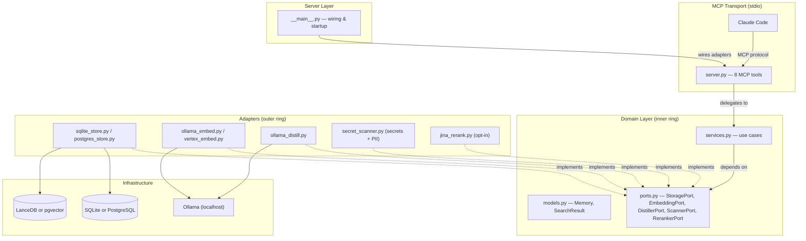

# Architecture

Distill follows Clean Architecture (Uncle Bob). Dependencies point inward. Business logic has no knowledge of frameworks, databases, or transport.

## Layer diagram



## Directory structure

```
src/distill_mcp/
├── domain/              # Inner ring: pure business logic, no dependencies
│   ├── models.py        # Memory, DistilledMemory, SearchResult (dataclasses/Pydantic)
│   ├── ports.py         # Abstract interfaces (StoragePort, EmbeddingPort, DistillerPort)
│   └── services.py      # Use cases: remember, search, update, forget
│
├── adapters/            # Outer ring: implementations of ports
│   ├── storage/
│   │   ├── sqlite_store.py    # StoragePort → SQLite + FTS5 + LanceDB
│   │   └── postgres_store.py  # StoragePort → asyncpg + pgvector + tsvector
│   ├── embeddings/
│   │   ├── ollama_embed.py    # EmbeddingPort → local Ollama
│   │   └── vertex_embed.py    # EmbeddingPort → Vertex AI
│   ├── distiller/
│   │   └── ollama_distill.py  # DistillerPort → local Ollama (always local)
│   ├── scanner/
│   │   └── secret_scanner.py  # ScannerPort → secrets + PII redaction
│   └── reranker/
│       └── jina_rerank.py     # RerankerPort → Jina Reranker API (opt-in)
│
├── server.py            # FastMCP tool definitions — thin adapter
├── settings.py          # pydantic-settings, env var loading
└── __main__.py          # Entry point: wires adapters, starts FastMCP
```

## The dependency rule

`server.py` depends on `domain/services.py`. Services depend on `domain/ports.py`. Adapters implement ports. **Nothing in `domain/` imports from `adapters/`.**

This means you can swap SQLite for PostgreSQL, or Ollama embeddings for Vertex AI, without touching any business logic.

## Backend options

| Backend | Storage | Vectors | Embeddings | Distillation | Cost |
|---------|---------|---------|------------|--------------|------|
| `local` | SQLite + FTS5 | LanceDB | Ollama | Ollama | $0 |
| `gcp` | Cloud SQL PostgreSQL | pgvector | Vertex AI | Ollama (local) | ~$11/mo |
| `aws` | RDS PostgreSQL | pgvector | Bedrock | Ollama (local) | ~$15/mo |
| `azure` | Azure Database for PostgreSQL | pgvector | Azure OpenAI | Ollama (local) | ~$14/mo |

Distillation is **always local** regardless of backend — this is the privacy guarantee.

## Key execution flows

### Remember (two-phase commit)

1. `remember()` sends raw text to local Ollama for distillation
2. Scanner checks the output for leaked secrets
3. Dedup check rejects if cosine similarity > 0.95 with existing memory
4. Returns a preview with `pending_id` — memory is NOT stored yet
5. User reviews and approves
6. `confirm_memory()` saves to the storage backend

### Search (hybrid with RRF)

1. Query is embedded via `EmbeddingPort` (768-dim vector)
2. Full-text search runs in parallel with vector similarity search
3. Results are merged using Reciprocal Rank Fusion (k=60)
4. Optional cross-encoder reranking via `RerankerPort` (Jina API, GCP-only)
5. Level-aware boost — multipliers based on memory level: short-term ×0.8, long-term ×1.0, shared ×1.2
6. Weibull time-decay boost — type-aware recency scoring (decisions decay fast, patterns persist)
7. Access-frequency boost — frequently accessed memories rank higher
8. Returns compact index (~30 tokens/result) for progressive disclosure
9. Client fetches full content with `get_memories` for relevant results only

### Weibull time-decay

Instead of a simple inverse decay, memories decay at rates appropriate to their type:

| Type | Scale (λ) | Shape (k) | Behavior |
|------|-----------|-----------|----------|
| `context` | 7 days | 2.0 | Fastest decay — ephemeral |
| `decision` | 14 days | 1.5 | Fast — decisions get superseded |
| `failure` | 45 days | 1.2 | Medium — failures become less relevant |
| `pattern` | 90 days | 0.8 | Slow — patterns are durable |
| `dependency` | 180 days | 0.7 | Slowest — dependency choices are long-lived |

The Weibull survival function `S(t) = exp(-(t/λ)^k)` starts at 1.0 and decays toward 0. The shape parameter `k` controls the decay curve: `k < 1` gives a long tail (useful for durable knowledge), `k > 1` gives accelerating decay (useful for ephemeral context).
