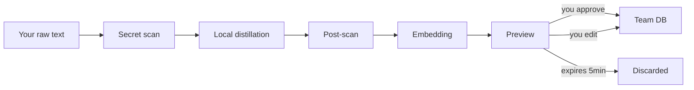

# How Memory Works

This page explains the complete memory lifecycle — from your raw input to a searchable team knowledge base. If you work with Claude Code daily, this is the mental model you need.

## The big picture

When you tell Claude "remember this", your input doesn't go straight into a database. It passes through a multi-stage pipeline:



Every stage exists for a reason:

| Stage | Purpose |
|-------|---------|
| Secret scan | Redacts API keys, tokens, passwords **before** they reach even the local LLM |
| Distillation | Strips personal language, names, emotions — keeps only technical facts |
| Post-scan | Catches anything the LLM accidentally reproduced (hard block) |
| Embedding | Converts text to a 768-dim vector for similarity search |
| Preview | You see exactly what will be stored before it enters the team DB |

## What distillation actually does

The local LLM (Ollama, running on your machine) transforms your raw input into impersonal, factual knowledge. Here's what that looks like in practice:

**Your input:**

> "I spent 3 hours debugging this yesterday and it turns out the auth middleware was silently swallowing 401 responses because someone hardcoded a fallback to 200 in error_handler.py. So frustrating. @jake found it."

**Distilled output:**

> "Auth middleware in error_handler.py silently converts 401 responses to 200 due to a hardcoded fallback in the error handler. Identified 2026-03-18."

Notice what changed:

- "I spent 3 hours" → removed (first-person, emotional)
- "yesterday" → "2026-03-18" (absolute date)
- "So frustrating" → removed (emotional language)
- "@jake found it" → removed (personal attribution)
- The technical fact is preserved exactly

**Another example:**

> "We decided in standup to use Celery instead of RQ because we need retry logic and RQ's retry support is basically nonexistent"

**Distilled output:**

> "Celery chosen over RQ for task queue. Reason: RQ lacks robust retry support."

The distiller compresses to 1–3 factual sentences. No bullet points, no headers — just dense knowledge.

### When distillation rejects input

Not everything becomes a memory. The system rejects:

- **Noise:** "ok", "thanks", "lgtm", "sure" — trivial chat
- **Too short:** Anything under 20 characters
- **Too long:** Over 8,000 characters (configurable via `MAX_MEMORY_SIZE`)
- **No technical content:** "Had a great weekend" → the distiller returns `NO_FACTUAL_CONTENT` and the memory is rejected

## The preview flow

By default, nothing is stored without your explicit approval.

### Step 1: You trigger `remember`

Claude calls the `remember` tool with your input. The system:

1. Scans for secrets and redacts them
2. Sends the cleaned text to local Ollama for distillation
3. Embeds the distilled text into a vector
4. Stores everything in a **pending entry** (in-memory, not persisted)
5. Returns a preview:

```json
{
  "status": "preview",
  "pending_id": "a1b2c3d4...",
  "distilled": "Celery chosen over RQ for task queue. Reason: RQ lacks robust retry support.",
  "expires_in_seconds": 300,
  "redacted_count": 0
}
```

At this point, nothing has been written to the team database.

### Step 2: You review

Claude shows you the distilled output. You have three choices:

1. **Approve as-is** → Claude calls `confirm_memory(id="a1b2c3d4...")`
2. **Edit and approve** → Claude calls `confirm_memory(id="a1b2c3d4...", override="your edited text")`
3. **Do nothing** → the pending entry expires after 5 minutes and is discarded

!!! warning "Why the preview matters"
    The distiller is a 4B parameter model running locally. It's fast but not perfect. Occasionally it drops an important detail or keeps something you'd rather not share. The preview is your safety net.

### Step 3: Confirmation

When `confirm_memory` is called:

1. The pending entry is claimed (prevents double-confirm)
2. A **dedup check** runs — if cosine similarity > 0.95 with an existing memory, it's rejected as duplicate
3. A new `Memory` is created with a fresh UUID and timestamp
4. It's saved to the storage backend (SQLite or PostgreSQL)
5. The raw text file in `~/.team-memory/private/` is deleted

### What about the raw text?

Your original input is written to `~/.team-memory/private/<pending_id>.txt` with file permissions `0600` (owner-only read/write). This file:

- Is **never synced** to any remote
- Is **deleted** after confirmation
- Exists only so you could audit what was distilled from what
- Can be deleted manually at any time (`rm ~/.team-memory/private/*`)

## Memory types

Every memory has a type that affects how long it stays relevant in search results. Choose the type that matches the **nature** of the knowledge, not its importance:

| Type | What it captures | Decay rate | Examples |
|------|-----------------|------------|----------|
| `decision` | Choices and their rationale | Fast (14 days) | "Chose Celery over RQ", "Moved from REST to gRPC" |
| `context` | Situational knowledge | Very fast (7 days) | "Deploy freeze until Thursday", "API down for maintenance" |
| `failure` | What went wrong and why | Medium (45 days) | "OOM on staging due to unbounded cache", "Migration failed on FK constraint" |
| `pattern` | Established conventions | Slow (90 days) | "All API responses use envelope format", "Tests use factory_boy, not fixtures" |
| `dependency` | Technology and version choices | Very slow (180 days) | "PostgreSQL 16 on RDS", "Python 3.12 minimum" |

!!! note "Decay doesn't delete"
    The decay rate affects **search ranking**, not storage. A 6-month-old decision still exists — it just ranks lower than yesterday's decision for the same topic. You can always find it with `get_memory(id)` or by searching specifically.

### Why type-aware decay?

Consider a decision like "We're using Redis for session storage". After 6 months, either:

- It's still true → it should appear in search, but a newer decision about the same topic should rank higher
- It was superseded → the newer memory naturally outranks it

Meanwhile, a pattern like "All API handlers validate input with Pydantic" stays relevant for months. A flat decay rate would either penalize durable patterns or keep stale decisions artificially high.

The math behind this is a **Weibull survival function**: `S(t) = exp(-(t/λ)^k)`, where λ is the scale (how many days until significant decay) and k is the shape (how the curve bends). You don't need to know the formula — just pick the right type.

## Memory levels

Each memory has a **level** derived from its type. Levels group types by how broadly the knowledge applies:

| Level | Types | What it means |
|-------|-------|---------------|
| `short-term` | `context` | Ephemeral, situational — relevant right now |
| `long-term` | `decision`, `pattern`, `failure`, `dependency` | Durable project knowledge |
| `shared` | *(multi-repo memories)* | Knowledge that spans multiple repositories |

Levels affect search scoring through multipliers applied during ranking:

- **Short-term:** ×0.8 — slightly deprioritized since it's transient
- **Long-term:** ×1.0 — baseline weight
- **Shared:** ×1.2 — boosted because cross-repo knowledge is harder to rediscover

You don't set the level directly. It's derived from the memory type and repo scope.

## How search works

When Claude calls `search_memory`, a hybrid search pipeline runs:

### 1. Dual retrieval

The query is processed through two independent search systems simultaneously:

- **Full-text search (FTS):** Keyword matching. Good for exact terms like "Redis", "OOM error", "migration"
- **Vector similarity:** Semantic matching. Good for conceptual queries like "how do we handle auth" even if the memory says "authentication middleware"

Both systems return ranked candidate lists.

### 2. Reciprocal Rank Fusion (RRF)

The two ranked lists are merged using RRF with k=60:

```
score(doc) = 1/(60 + rank_fts) + 1/(60 + rank_vec)
```

A memory that ranks high in **both** lists gets a combined score. A memory that ranks #1 in FTS but doesn't appear in vector results still gets credit, just less.

Why RRF instead of a weighted average? Because FTS and vector scores are on different scales and aren't directly comparable. RRF only uses rank positions, so it works regardless of how each system scores internally.

### 3. Optional cross-encoder reranking

If enabled (`RERANK_ENABLED=true`), the top candidates are re-scored by a cross-encoder model (Jina) that reads query and document together. This is more accurate than embedding similarity but slower and requires an API key.

### 4. Weibull recency boost

Each result gets a time-decay adjustment based on its type:

```
final_score = 0.85 × base_score + 0.15 × weibull_recency
```

A 1-day-old `decision` gets nearly full recency boost. A 30-day-old `decision` gets ~5%. A 30-day-old `pattern` still gets ~72%.

### 5. Access-frequency boost

Memories that are frequently accessed in search results get a small boost:

```
final_score *= 1.0 + log(access_count + 1) × 0.1
```

This creates a feedback loop: useful memories surface more often, which makes them even more discoverable. The `log` dampens the effect so a memory accessed 100 times isn't dramatically different from one accessed 50 times.

### 6. Score threshold

Results below 0.35 are dropped. This prevents low-confidence matches from cluttering the output.

### What you get back

Search returns a **compact index**, not full content:

```json
[
  {
    "id": "abc123",
    "type": "decision",
    "snippet": "Celery chosen over RQ for task queue. Reason: RQ lacks robust...",
    "repos": ["myapp"],
    "score": 0.87,
    "created_at": "2026-03-18T14:30:00Z",
    "est_tokens": 25,
    "agent_id": null
  }
]
```

Each result costs ~30 tokens. For 5 results, that's ~150 tokens — cheap enough that Claude can search proactively without burning through your context window.

## Progressive disclosure

The search response is deliberately compact. This is a design choice called **progressive disclosure**:

**Layer 1 — `search_memory`:** Returns IDs, types, 80-char snippets, scores, and estimated token counts. Claude uses this to decide which memories are relevant.

**Layer 2 — `get_memories`:** Claude fetches full content only for the IDs it actually needs.

Why not return full content immediately? Because most search results aren't relevant to the current task. If `search_memory` returned 5 full memories at ~100 tokens each, that's 500 tokens consumed even if only 1 memory matters. With progressive disclosure, Claude spends ~150 tokens on the index and ~100 tokens on the one memory it actually uses.

This is especially important for agents running `search_memory` before every architectural decision — the protocol keeps the token budget predictable.

## Deduplication

Before any memory is saved, the system checks if a near-identical memory already exists by comparing embedding vectors:

- Cosine similarity ≥ 0.95 → **duplicate**, rejected with a pointer to the existing memory
- Below 0.95 → **unique**, proceeds to save

This threshold is deliberately high. Two memories about the same topic but with different details (e.g., "chose Redis for caching" vs. "chose Redis for session storage") will both be saved. Only near-verbatim duplicates are caught.

The dedup check runs at **confirmation time**, not at preview time. This means if you submit two identical memories within the preview window, the first one to be confirmed wins and the second gets a duplicate rejection.

## Contradiction detection

When `remember()` is called, the system doesn't just check for exact duplicates — it also looks for **related memories** that might contradict the new one.

After distillation, the system searches for existing memories with cosine similarity > 0.80 (well below the 0.95 dedup threshold). These are returned in the preview response as `related_memories`:

```json
{
  "status": "preview",
  "pending_id": "a1b2c3d4...",
  "distilled": "Redis chosen for session storage. Reason: need TTL support.",
  "related_memories": [
    {
      "id": "xyz789",
      "snippet": "Memcached chosen for session storage. Reason: simpler operational model.",
      "similarity": 0.88
    }
  ]
}
```

The system doesn't automatically resolve contradictions — that's a human judgment call. When you review the preview, you decide whether the new memory supersedes an existing one. If it does, pass the superseded IDs during confirmation:

```
confirm_memory(id="a1b2c3d4...", supersedes=["xyz789"])
```

This soft-deletes the old memory and records the supersession chain, keeping the knowledge base consistent without silent data loss.

## Updating memories

`update_memory` doesn't edit in place. It creates a **new memory** and soft-deletes the old one:

1. Fetches the existing memory
2. Distills your new input
3. Embeds the distilled text
4. Saves a new memory with `supersedes=old_id`
5. Soft-deletes the old memory (sets `deleted_at`)

The old memory stops appearing in search results, but the chain of supersession is preserved in the database. This means you can always trace how knowledge evolved.

## Forgetting

`forget` is a soft delete — it sets `deleted_at` on the memory, which excludes it from all search results. The data isn't physically removed from the database.

When `agent_id` is provided, forget only works if the memory belongs to that agent. This prevents one agent from accidentally deleting another agent's knowledge.

## Stale memory detection

The `list_stale` tool identifies memories that have outlived their usefulness. It combines two signals:

- **Weibull survival score < 0.1** — the memory has decayed past its type-appropriate lifespan
- **Access count < 2** — nobody is finding it useful in search results

Both conditions must be true. A frequently accessed old memory isn't stale — it's still providing value. A rarely accessed recent memory isn't stale either — it hasn't had time to prove itself.

The staleness thresholds are type-aware because each type has a different natural lifespan:

| Type | Approximate stale age |
|------|----------------------|
| `context` | ~15 days |
| `decision` | ~30 days |
| `failure` | ~60 days |
| `pattern` | Several months |
| `dependency` | Several months |

`list_stale` returns candidates for review — it doesn't delete anything automatically. You decide whether to `forget` them or leave them in place.

## Multi-agent support

Every tool accepts an optional `agent_id` parameter. When set:

- **Remember:** The memory is tagged with the agent's ID
- **Search:** Results can be filtered to only that agent's memories
- **Forget:** Only the owning agent can delete its memories

This allows multiple Claude Code instances (or custom agents) to maintain isolated knowledge bases within the same database. Omitting `agent_id` gives access to all memories.

## Storage backends

### Local (SQLite + LanceDB)

The default. Everything runs on your machine:

- **Memories:** SQLite with WAL mode for concurrent reads
- **Full-text search:** FTS5 with unicode61 tokenizer
- **Vectors:** LanceDB (embedded, file-based) with cosine distance
- **Data directory:** `~/.team-memory/` (configurable via `DATA_DIR`)

Good for: Solo developers, local-first workflows, air-gapped environments.

### PostgreSQL (asyncpg + pgvector)

For teams sharing a knowledge base:

- **Memories:** PostgreSQL with JSONB for repos/tags
- **Full-text search:** Generated tsvector column with GIN index
- **Vectors:** pgvector extension with IVFFlat index (created after 100+ rows)
- **Row-Level Security:** When `AUTH_ENABLED=true`, queries are scoped to the developer's repos

Good for: Teams, shared knowledge bases, cloud deployments (Neon, Cloud SQL, RDS).

Both backends implement the same `StoragePort` interface. The domain layer doesn't know which one is running — you can switch by changing `BACKEND=local` to `BACKEND=postgres` and providing a `DATABASE_URL`.

## Putting it all together

Here's what a typical day looks like for a developer using Distill with Claude Code:

**Morning — context loading:**
Claude calls `search_memory` before proposing architecture for a new feature. It finds 3 relevant memories from last week's decisions. You see the compact index, Claude fetches full content for 2 of them, and adjusts its proposal accordingly.

**During work — capturing decisions:**
You and Claude decide to use WebSockets instead of SSE. Claude calls `remember` with the decision and rationale. You see the distilled preview, approve it, and it's stored as a `decision` type.

**Debugging — finding prior failures:**
You hit a cryptic error. Claude searches for related failures and finds a memory from 3 weeks ago: "Service mesh timeout caused by Envoy default idle_timeout=1h conflicting with long-polling connections. Fix: set idle_timeout=0 in Envoy config." Crisis averted.

**New team member — onboarding:**
A colleague sets up Distill pointed at the same PostgreSQL database. They immediately have access to months of team decisions, patterns, and failure lessons — without ever reading through Slack history or meeting notes.
