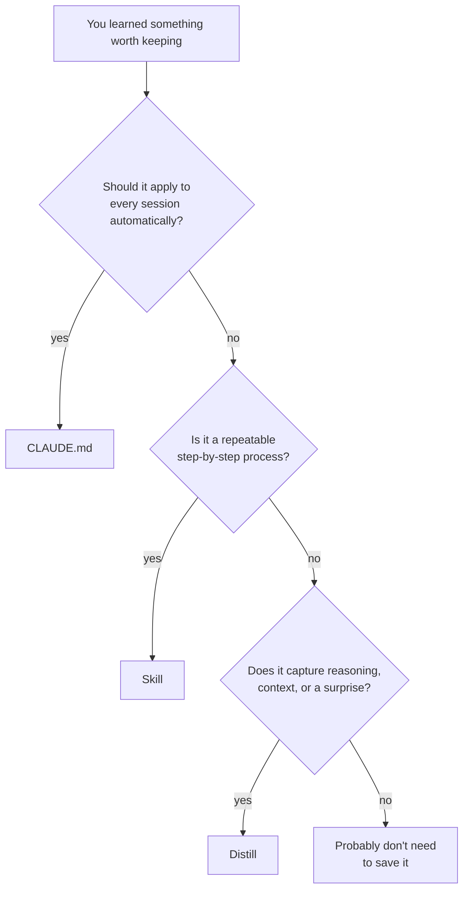

# When to Use Distill

Claude Code has three persistence mechanisms for knowledge. They serve different purposes and have different half-lives. Knowing which one to reach for saves you from storing things in the wrong place -- or not storing them at all.

## The three mechanisms

| Mechanism | What it stores | Half-life | Loaded |
|-----------|---------------|-----------|--------|
| **CLAUDE.md** | Conventions, guardrails, project rules | Months--years | Automatically, every session |
| **Skills** | Repeatable processes, recipes | Weeks--months | On demand, when invoked |
| **Distill** | Decision context, failure postmortems, team knowledge | Days--weeks | On demand, via search |

They differ along three axes:

- **Durability:** How long the knowledge stays relevant
- **Specificity:** How tied the knowledge is to a particular situation
- **Activation:** Whether Claude reads it automatically or on demand

## CLAUDE.md -- the guardrails

Use CLAUDE.md when the knowledge is **deterministic and universal**. It should apply to every session, every developer, every time.

```markdown
# Example CLAUDE.md entries

- All API responses use envelope format: { data, error, meta }
- Tests use factory_boy, not fixtures
- Never skip pre-commit hooks
- Use gRPC for inter-service communication
```

CLAUDE.md is read automatically at the start of every conversation. There's no retrieval step, no search query -- it's always in context. This makes it the right place for hard rules that should never be violated.

**Good fit:** Coding standards, architectural constraints, tooling preferences, "never do X" rules.

**Bad fit:** Explanations of *why* a rule exists, step-by-step procedures, context that only applies sometimes.

## Skills -- the recipes

Use a skill when the knowledge is **procedural and reusable**. A skill is a step-by-step process that you'd otherwise explain from scratch each time.

```markdown
# Example: cloud-run-deploy skill

1. Copy image to Artifact Registry (Cloud Run rejects ghcr.io/quay.io)
2. Create GCS bucket for persistent storage
3. Deploy with gcloud run services replace using multi-container YAML
4. Map custom domain via gcloud beta run domain-mappings create
5. Wait for certificate provisioning (5-15 min)
```

Skills are invoked on demand -- Claude doesn't read them unless you ask for them or a matching trigger fires. This keeps them out of the context window until needed, but means they must be explicitly activated.

**Good fit:** Deployment procedures, debugging workflows, setup guides, migration playbooks.

**Bad fit:** One-time decisions, project-specific context, knowledge that changes frequently.

## Distill -- the context

Use Distill when the knowledge **emerged from work** and captures reasoning that code and commit messages don't preserve.

```
# Example distill memories

"Celery chosen over RQ for task queue. Reason: RQ lacks robust retry support."

"GCS FUSE with SQLite causes BufferedWriteHandler errors on .db-shm files.
 Migrations still run but WAL mode is unreliable. Use ephemeral storage or
 a real database for production."

"IAP requires GCP organization. Personal Gmail projects must use oauth2-proxy
 or basic auth instead."
```

Distill memories are searched on demand -- Claude queries them before proposing architecture or when debugging unfamiliar issues. The LLM distillation strips PII, emotions, and credentials automatically, making memories safe to share across a team.

**Good fit:** Decision rationale ("we chose X because Y"), failure postmortems ("Z broke because of W"), surprising discoveries, things you'd tell a new team member.

**Bad fit:** Deterministic rules (use CLAUDE.md), step-by-step procedures (use a skill), things already captured in code or commit messages.

## Decision flowchart



## One session, all three

A single debugging session might produce entries for all three mechanisms:

| What you learned | Where it goes |
|-----------------|---------------|
| "Always check connection pool exhaustion before blaming the query" | **CLAUDE.md** -- universal rule |
| The 12-step procedure for diagnosing connection pool issues | **Skill** -- reusable recipe |
| "The March 2026 outage was caused by a Pgbouncer misconfiguration after the Neon migration, not a slow query" | **Distill** -- specific context |

The rule tells Claude *what* to do. The skill tells it *how*. The memory tells the team *why* this matters -- and prevents someone from repeating the same investigation six months later.

## When Distill is uniquely valuable

Distill fills a gap that the other two mechanisms can't:

1. **Cross-session reasoning.** "We tried approach A three weeks ago and it failed because of X" -- this context is lost between conversations unless captured.

2. **Team onboarding.** A new developer connecting to the shared PostgreSQL backend immediately has access to months of decisions, failures, and patterns -- without reading Slack history.

3. **Contradiction detection.** When you store a new decision, Distill surfaces related memories that might conflict. "Last month the team chose Memcached for sessions, but you're now saying Redis -- want to supersede?"

4. **Automatic privacy.** Raw input like "I spent 3 hours on this and @jake's code was the problem" becomes "Auth middleware silently converts 401 to 200 due to hardcoded fallback." No manual redaction needed.
