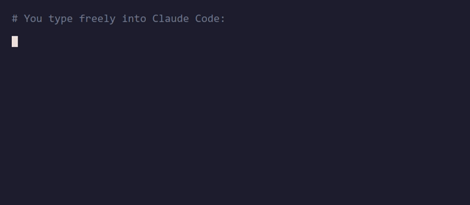
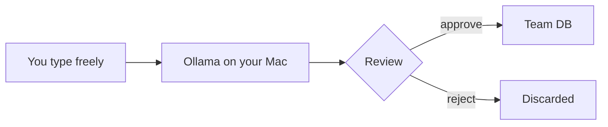

# 🧪 Distill

**Privacy-first team memory for Claude Code.**

An MCP server that gives Claude Code a shared team knowledge base. A local LLM transforms your raw input into anonymous, factual knowledge *before* anything leaves your device.

No author. No frustration. No names. Just a clean, reusable fact.





## Quick start

```bash
pip install distill-mcp
ollama pull gemma3:4b && ollama pull nomic-embed-text
claude mcp add distill -- python -m distill_mcp
```

Then in Claude Code:

```
You:    "Remember that we chose gRPC over REST for streaming and type safety."
Claude: [distills locally, shows preview, waits for approval, saves]
```

## Documentation

This site follows the [Diataxis](https://diataxis.fr/) framework:

- **[Tutorials](tutorials/getting-started.md)** — Step-by-step guides for getting started
- **[How-To Guides](how-to/installation.md)** — Task-oriented recipes for specific goals
- **[Reference](reference/tools.md)** — Technical details: tools, configuration, ports
- **[Explanation](explanation/architecture.md)** — Architecture, privacy model, design decisions
